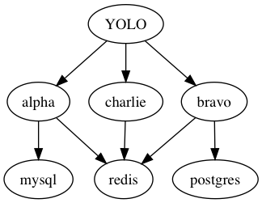

[](http://godoc.org/github.com/dollarshaveclub/metahelm/pkg/metahelm)
[](https://circleci.com/gh/dollarshaveclub/metahelm)

# Metahelm

Metahelm is a CLI and library for installing dependency graphs of Helm charts.

## Why?

Helm dependency handling doesn't handle complex trees of dependencies well. It creates all Kubernetes objects at once and waits for them to settle into a consistent state.

With complex sets of dependency relationships, this means one or more applications go into CrashLoopBackoff, greatly lengthening the time for the entire tree to come up. Sometimes they will completely fail when one or more applications gives up entirely.

## What does Metahelm do?

Metahelm takes a list of charts (as YAML) with dependency relationships specified,
and optionally a way for Metahelm to tell when a chart is "up" or successful.

Metahelm will build a dependency graph (DAG) of the charts and install them in
order such that all dependencies are satisfied prior to each chart install.

## Sample YAML

Say you have a primary application ("YOLO") that depends upon several
microservices to be running for the primary app to start. Those microservices are called
"Alpha", "Bravo" and "Charlie". "Alpha" depends upon a MySQL database, "Bravo" needs
PostgreSQL and all three need Redis.

An example YAML input might look like the following:

```yaml
- name: YOLO
  path: /home/charts/yolo
  values_path: /home/releases/yolo/values.yml
  primary_deployment: yolo
  dependencies:
    - alpha
    - bravo
    - charlie
- name: alpha
  path: /home/charts/alpha
  values_path: /home/releases/alpha/values.yml
  primary_deployment: alpha
  wait_for_all_pods: true
  dependencies:
    - mysql
    - redis
- name: bravo
  path: /home/charts/bravo
  values_path: /home/releases/bravo/values.yml
  primary_deployment: bravo
  wait_for_all_pods: true
  dependencies:
    - postgres
    - redis
- name: charlie
  path: /home/charts/charlie
  values_path: /home/releases/charlie/values.yml
  primary_deployment: charlie
  wait_for_all_pods: true
  dependencies:
    - redis
- name: mysql
  path: /home/charts/mysql
  values_path: /home/releases/mysql/values.yml
  primary_deployment: mysql
- name: postgres
  path: /home/charts/postgres
  values_path: /home/releases/postgres/values.yml
  primary_deployment: postgres
- name: redis
  path: /home/charts/redis
  values_path: /home/releases/redis/values.yml
  primary_deployment: redis
```

Using `metahelm plan -g` produces a graph like this:


...and an execution plan:

```
Graph Root: YOLO
Phase 1: ["mysql" "postgres" "redis"]
Phase 2: ["charlie" "alpha" "bravo"]
Phase 3: ["YOLO"]
```

Phase 1 is installed first. The Mysql, postgres and redis charts would be installed
in parallel. When they are all determined to be healthy, Phase 2 ("Charlie", "Alpha", "Bravo")
would be installed in a similar fashion. Finally, Phase 3 ("YOLO") would be installed.
